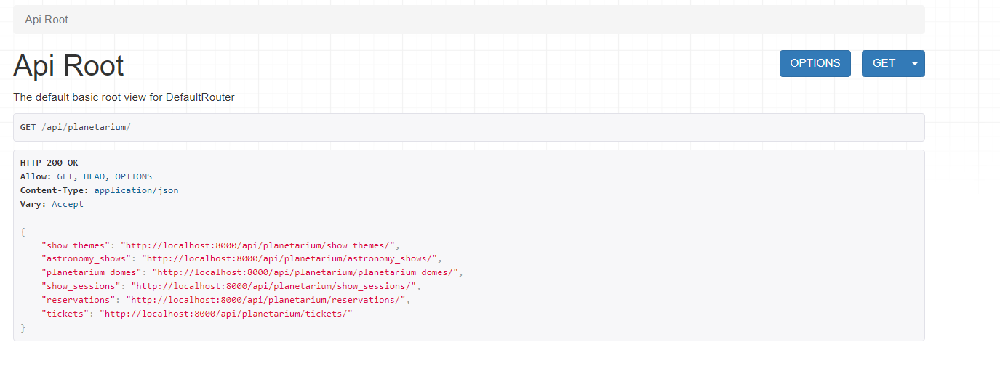
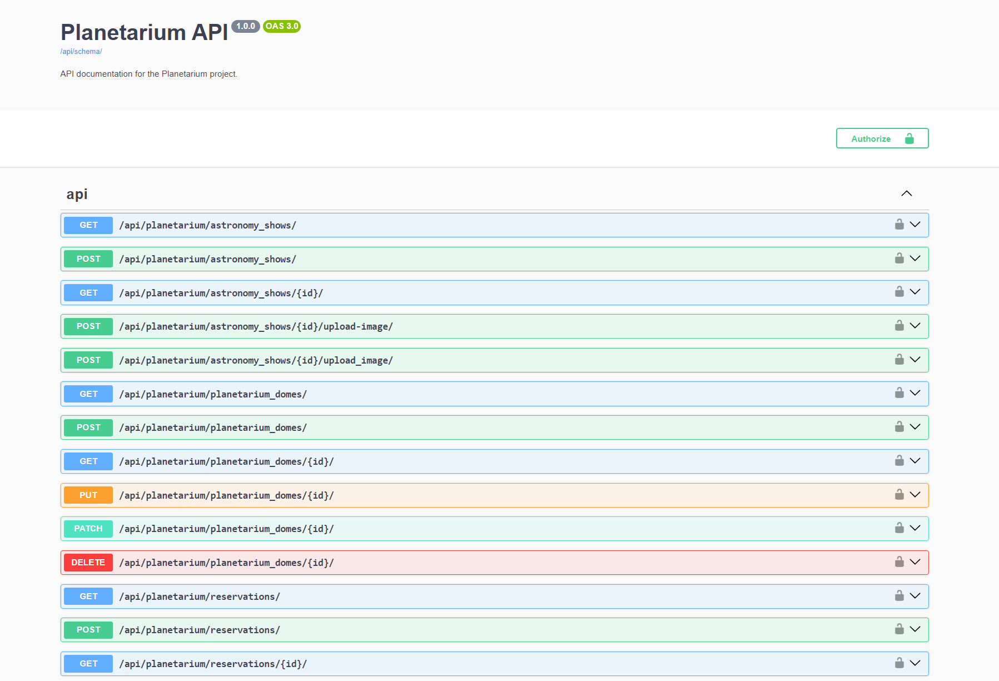

# Planetarium Management API Documentation

## Overview
This is the Planetarium Management API, designed to provide a comprehensive set of endpoints for managing the entire planetarium ecosystem. The API allows for the creation, retrieval, updating, and deletion of various entities within the planetarium system, including shows, themes, domes, sessions, reservations, and tickets. Additionally, it includes endpoints for user authentication and management, supporting JWT token-based authentication.
## Features
- JWT token authentication
- Swagger documentation
- Throttling for anonymous and authenticated users
- API pagination
- Image uploading

## Endpoints
The Planetarium API has many endpoints to manage themes, shows, sessions, domes, reservations, and tickets. The User API offers multiple useful endpoints for user management. You can use these endpoints to buy tickets, check reservation history, and perform many other operations.


For detailed endpoint information, check the Swagger documentation at `/api/docs/swagger/`.


## Installation

### Prerequisites
- Python 3.7+
- Docker (for Docker installation)

### Clone the Repository
```bash
git clone https://github.com/Gilgumish/planetarium-api-service/tree/develop
cd planetarium-api-service
```

### Virtual Environment Setup

#### Windows
```powershell
python -m venv venv
venv\Scripts\Activate
```

#### Unix systems
```bash
python3 -m venv venv
source venv/bin/activate
```

### Environment Configuration

You can create an `.env` file in the root of the project directory using the provided `create_env.sh` script. This script will generate the `.env` file with the necessary fields. 

Run the following command in your project directory:

```bash
./create_env.sh
```

The script will prompt you to input values for the fields or use default values. The `.env` file will be created with the following fields:

```
POSTGRES_DB_STATUS=True or False
POSTGRES_PASSWORD=planetarium
POSTGRES_USER=planetarium
POSTGRES_DB=planetarium
POSTGRES_HOST=db
POSTGRES_PORT=5432
PGDATA=/var/lib/postgresql/data
SECRET_KEY=your_secret_key
```

Make sure `USE_POSTGRES=False` in the `.env` file for local installation.

### Local Installation
Install the required dependencies:

```bash
pip install -r requirements.txt
```

Apply the database migrations:

```bash
python manage.py migrate
```

Start the development server:

```bash
python manage.py runserver
```

### Docker Local Installation
Build and start the Docker containers:

```bash
docker-compose up --build
```

## API Endpoints

### Authentication
- `POST /api/user/register/`: Register a new user
- `POST /api/user/token/`: Log in to obtain JWT tokens
- `POST /api/user/token/refresh/`: Refresh JWT tokens
- `POST /api/user/token/verify/`: Verify JWT tokens
- `GET /api/user/me/`: Retrieve authenticated user's data

### Themes
- `GET /api/planetarium/show_themes/`: List all show themes
- `POST /api/planetarium/show_themes/`: Create a new show theme
- `GET /api/planetarium/show_themes/{id}/`: Retrieve a specific show theme
- `PUT /api/planetarium/show_themes/{id}/`: Update a specific show theme
- `DELETE /api/planetarium/show_themes/{id}/`: Delete a specific show theme

### Shows
- `GET /api/planetarium/shows/`: List all shows
- `POST /api/planetarium/shows/`: Create a new show
- `GET /api/planetarium/shows/{id}/`: Retrieve a specific show
- `PUT /api/planetarium/shows/{id}/`: Update a specific show
- `DELETE /api/planetarium/shows/{id}/`: Delete a specific show
- `POST /api/planetarium/shows/{id}/upload_image/`: Upload an image for a show

### Domes
- `GET /api/planetarium/domes/`: List all domes
- `POST /api/planetarium/domes/`: Create a new dome
- `GET /api/planetarium/domes/{id}/`: Retrieve a specific dome
- `PUT /api/planetarium/domes/{id}/`: Update a specific dome
- `DELETE /api/planetarium/domes/{id}/`: Delete a specific dome

### Sessions
- `GET /api/planetarium/sessions/`: List all show sessions
- `POST /api/planetarium/sessions/`: Create a new show session
- `GET /api/planetarium/sessions/{id}/`: Retrieve a specific show session
- `PUT /api/planetarium/sessions/{id}/`: Update a specific show session
- `DELETE /api/planetarium/sessions/{id}/`: Delete a specific show session

### Reservations
- `GET /api/planetarium/reservations/`: List all reservations
- `POST /api/planetarium/reservations/`: Create a new reservation
- `GET /api/planetarium/reservations/{id}/`: Retrieve a specific reservation
- `PUT /api/planetarium/reservations/{id}/`: Update a specific reservation
- `DELETE /api/planetarium/reservations/{id}/`: Delete a specific reservation

### Tickets
- `GET /api/planetarium/tickets/`: List all tickets
- `POST /api/planetarium/tickets/`: Create a new ticket
- `GET /api/planetarium/tickets/{id}/`: Retrieve a specific ticket
- `PUT /api/planetarium/tickets/{id}/`: Update a specific ticket
- `DELETE /api/planetarium/tickets/{id}/`: Delete a specific ticket

## Usage

### API Authentication
All API requests (except for the authentication endpoints) require a valid JWT token. To obtain a token, you must first register and then log in. Include the token in the `Authorization` header of your requests as follows:

```http
Authorization: Bearer <your-token>
```

### Throttling
The API has built-in throttling to limit the number of requests. The limits are:
- **Anonymous Users**: 10 requests per minute
- **Authenticated Users**: 100 requests per minute

### Pagination
The API supports pagination for endpoints that return a list of items. The default page size is 10 items. You can customize the page size by adding a `page_size` query parameter to your request.

### Image Uploading
For endpoints that support image uploading, use the `multipart/form-data` content type and include the image file in the request payload.

